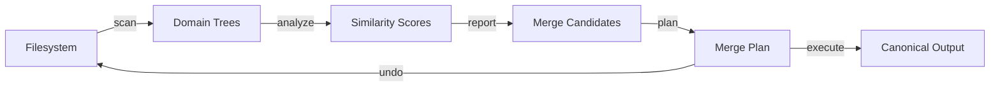
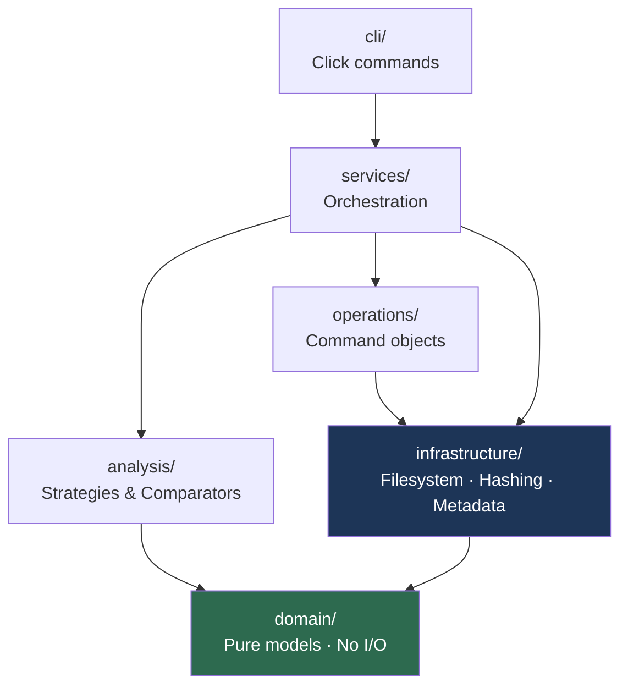
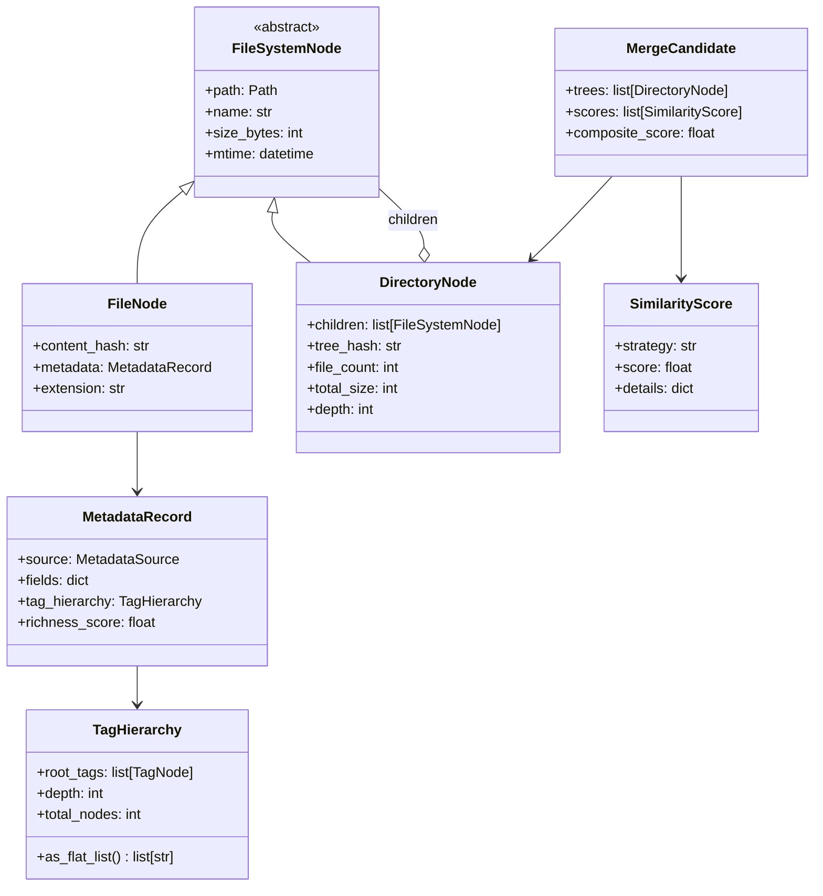
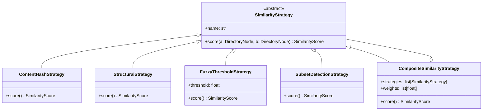
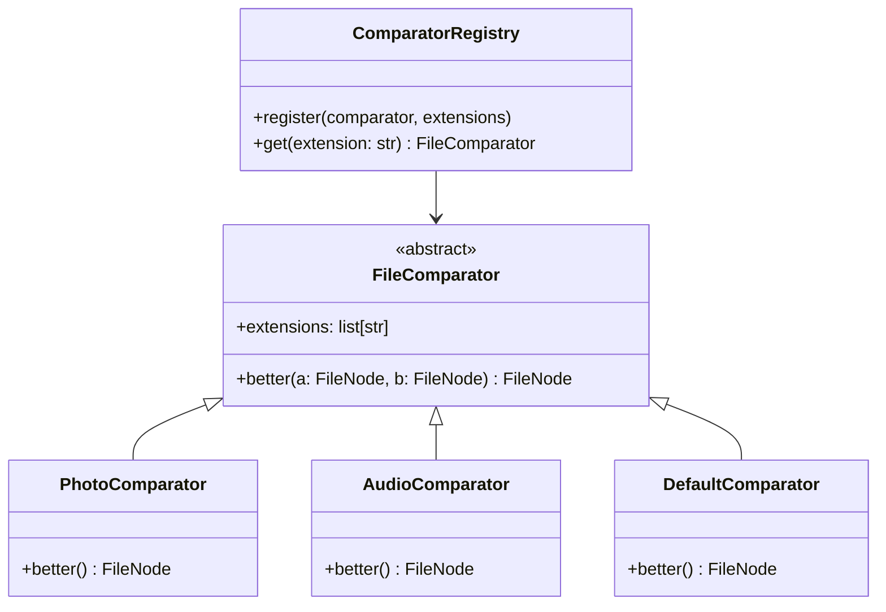
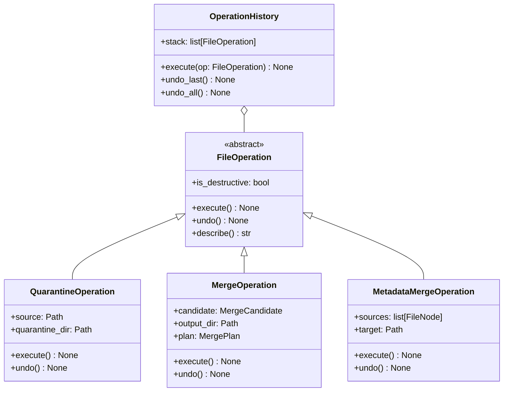
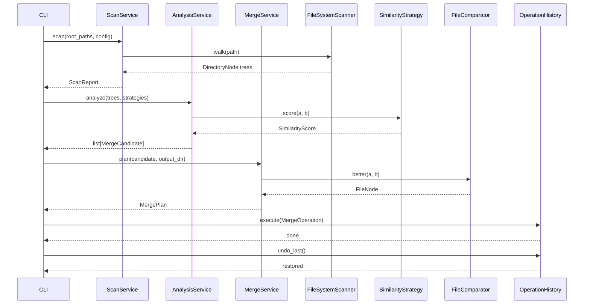

# Design 01 — FunkyFileCleanup Core Architecture

**Status:** Approved  
**Author:** John Funk  
**Created:** 2026-04-16

---

## Purpose

FunkyFileCleanup is a tool for identifying, analyzing, and merging near-duplicate
*directory trees* — entire project or collection structures that exist in multiple
versions across a filesystem. It is not a simple file deduplicator; it understands
structural similarity, file-type semantics, and embedded metadata.

The primary domain is photo collections with rich XMP/IPTC/EXIF hierarchical tag
metadata, but the architecture is designed to generalize to any file domain (video
projects, audio albums, etc.).

**Core principle:** A file with richer metadata is categorically better than one
without, regardless of file size or modification date.

---

## High-Level Pipeline

---

## Layer Architecture

Each layer depends only on layers below it. The domain layer has zero external
dependencies and can be unit-tested without touching the filesystem.

---

## Domain Model

---

## Similarity Analysis — Strategy Pattern

---

## File Comparators — "Best Version" Selection

**Selection priority by type:**

| Comparator | Priority Order |
|------------|---------------|
| `PhotoComparator` | metadata richness → resolution → mtime |
| `AudioComparator` | bitrate → ID3 completeness → mtime |
| `DefaultComparator` | file size → mtime |

---

## Metadata Infrastructure — Factory Pattern

```mermaid
classDiagram
    class MetadataReader {
        <<abstract>>
        +read(path: Path) MetadataRecord
        +write(path: Path, record: MetadataRecord) None
        +supported_extensions: list[str]
    }

    class ExifToolReader {
        +read() MetadataRecord
        +write() None
        +supported_extensions: list[str]
    }

    class NullMetadataReader {
        +read() MetadataRecord
        +write() None
    }

    class MetadataReaderFactory {
        +register(reader: MetadataReader) None
        +get(extension: str) MetadataReader
    }

    MetadataReader <|-- ExifToolReader
    MetadataReader <|-- NullMetadataReader
    MetadataReaderFactory --> MetadataReader
```

**Library choice:** `pyexiftool` wrapping the ExifTool binary. It is the only tool
that correctly handles hierarchical XMP keyword trees, preserves all metadata on
write, and works across every photo format. Requires `brew install exiftool`.

`NullMetadataReader` returns an empty `MetadataRecord` for unsupported file types,
keeping the rest of the pipeline uniform.

---

## Operations — Command Pattern

`MetadataMergeOperation` writes the union of tags from all source file versions
into the target — preserving the richest possible metadata in the merged output.

---

## Service Orchestration

---

## Iterative Build Steps

| Step | Deliverable | Patterns |
|------|-------------|----------|
| 1 | `FileSystemNode`, `FileNode`, `DirectoryNode` domain models | Composite |
| 2 | `FileSystemScanner` — build domain trees from real filesystem | Infrastructure |
| 3 | `FileHasher` — SHA-256 with caching; `TreeHasher` | Infrastructure |
| 4 | `MetadataRecord`, `TagHierarchy`, `ExifToolReader` | Factory |
| 5 | `ContentHashStrategy` — first similarity score | Strategy |
| 6 | `StructuralStrategy`, `FuzzyThresholdStrategy`, `SubsetDetectionStrategy` | Strategy |
| 7 | `CompositeSimilarityStrategy` + `ComparatorRegistry` | Strategy, Composite |
| 8 | `PhotoComparator` — metadata-aware best-file selection | Strategy |
| 9 | `QuarantineOperation` + `OperationHistory` | Command |
| 10 | `ScanService` + `AnalysisService` orchestration | Service |
| 11 | CLI: `funky scan`, `funky analyze` | CLI |
| 12+ | `MergeOperation`, `MetadataMergeOperation`, interactive TUI | Command, Observer |

After each step: review what was learned, revisit the design if needed, then proceed.

---

## Testing Strategy

| Layer | Approach |
|-------|----------|
| Domain | Pure unit tests — no filesystem; use dataclasses and factory functions |
| Infrastructure | Integration tests against a fixture directory tree in `tests/fixtures/` |
| Strategies | Property-based tests (`hypothesis`) — empty trees, identical trees, subsets |
| Operations | Execute/undo round-trip tests for every command |
| CLI | `click.testing.CliRunner` for end-to-end command tests |

---

## Open Decisions

| Decision | Current Thinking | Revisit At |
|----------|-----------------|-----------|
| Scan result persistence | JSON initially | Step 9 — switch to SQLite if scale demands |
| Async filesystem walking | Synchronous first | Step 2 — profile on large trees |
| Metadata merge conflict resolution | Interactive prompt | Step 12 |
| TUI framework | `textual` likely | Step 12 |
| Config file format | TOML | Step 10 |
